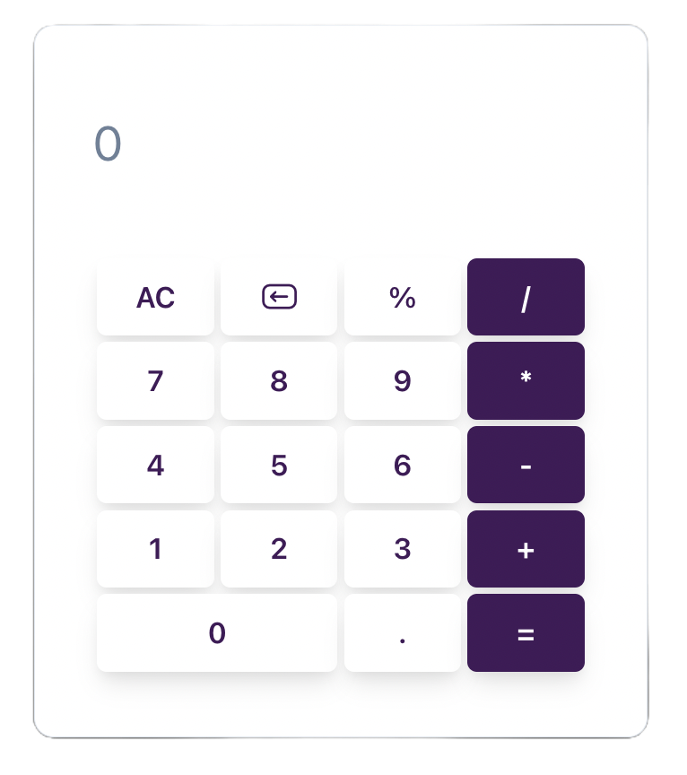

# React Calculator

This project is a simple calculator built with [React](https://reactjs.org/) and [Chakra UI](https://chakra-ui.com/). It allows you to perform basic mathematical operations such as addition, subtraction, multiplication, and division.

## Features

- Intuitive user interface.
- Basic mathematical operations: addition, subtraction, multiplication, division.
- Ability to delete the last number entered or reset the entire operation.
- Interactive keyboard: Operations can be performed by clicking the buttons or using the keyboard.
- Effect of moving the calculator wherever you like with the mouse.

## Technologies Used

- [Create React App](https://create-react-app.dev/)
- [Chakra UI](https://chakra-ui.com/)
- [mathjs](https://mathjs.org/)
- [iconior](https://iconoir.com/)
- [framer-motion](https://www.framer.com/motion/)

## Installation

1. Clone the repository: `git clone

2. Navigate to the project directory: `cd react-calculator`

3. Install the dependencies: `npm install`

4. Start the development server: `npm start`

5. Open [http://localhost:3000](http://localhost:3000) to view it in the browser.

## Screenshots

## Live Demo

[Live Demo Link](https://my-calculator-add.netlify.app/)

## Contributing

Contributions are welcome! If you have an idea or suggestion to improve this application, we encourage you to contribute. Please follow these steps to make your contributions easier to manage:

1. Fork the project. Start by forking the repository to your own GitHub account. This creates a personal copy for you to work on.
2. Create a new branch in your forked repository. Naming your branch something descriptive about the change you intend to make can be helpful. For example, git checkout -b feature/add-new-calculation-method.
3. Commit your changes. Make your changes in your local repository and commit them with a clear and descriptive commit message. This message should explain what you've done and why. For example, git commit -m "Add trigonometric functions to calculator".
4. Push to the branch. Push your changes to your GitHub repository. git push origin feature/add-new-calculation-method.

5. Open a pull request. Go to the original repository you forked from, and you'll see a banner to open a pull request with the changes you just pushed. Click on "Compare & pull request" and submit it with a clear description of your changes and what they improve. Be sure to mention any specific issues your pull request addresses.

## Contact

- 
- 
- 
